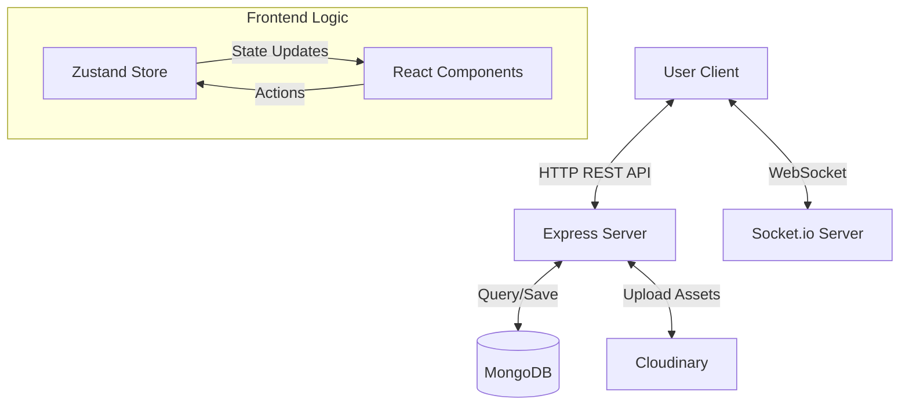

# Full Stack Realtime Chat App - Complete Study Guide

## 1. Project Overview
This is a comprehensive full-stack real-time chat application. It allows users to sign up, log in, see other users, and chat with them in real-time. It supports text, image, and video messages, along with online status indicators and theme customization.

### Key Features
- **Authentication**: Secure JWT-based signup and login.
- **Real-time Messaging**: Instant message delivery using Socket.io.
- **Media Support**: Image and video uploads via Cloudinary.
- **Online Status**: Real-time online/offline user status.
- **Theming**: Dynamic theme switching (light, dark, custom themes).
- **Responsive Design**: Fully responsive UI for desktop and mobile.

---

## 2. Tech Stack

### Backend
- **Runtime**: Node.js
- **Framework**: Express.js
- **Database**: MongoDB (with Mongoose ODM)
- **Authentication**: JSON Web Tokens (JWT) & bcryptjs
- **Real-time**: Socket.io (Server)
- **Cloud Storage**: Cloudinary (for images/videos)

### Frontend
- **Framework**: React (Vite)
- **State Management**: Zustand
- **Routing**: React Router DOM
- **Styling**: Tailwind CSS + DaisyUI
- **HTTP Client**: Axios
- **Real-time**: Socket.io-client
- **Icons**: Lucide React

---

## 3. Architecture & Data Flow

---

## 4. File-by-File Explanation (Deep Dive)

### Backend (`/backend/src`)

#### **Core Configuration**
- **`index.js`**: The entry point. It initializes the Express app, connects to MongoDB, sets up middleware (CORS, Cookie Parser), and defines the API routes (`/api/auth`, `/api/messages`). It also serves static frontend files in production.
- **`lib/db.js`**: Handles the connection to the MongoDB database using Mongoose. It logs success or error messages.
- **`lib/socket.js`**: Initializes the Socket.io server. It maintains a `userSocketMap` to track online users (mapping `userId` to `socketId`). It listens for connections and disconnections, emitting `getOnlineUsers` events to update clients.
- **`lib/utils.js`**: Contains `generateToken`. It generates a JWT for an authenticated user and sends it as a generic HTTP-Only cookie named `jwt`. This prevents XSS attacks.

#### **Models (Database Schemas)**
- **`models/user.model.js`**: Defines the User schema (email, fullName, password, profilePic).
- **`models/message.model.js`**: Defines the Message schema (senderId, receiverId, text, image, video). Uses `ObjectId` references to link to the User model.

#### **Middleware**
- **`middleware/auth.middleware.js`**: The `protectRoute` function. It checks for the `jwt` cookie. If present, it verifies the token, finds the user in the DB, and attaches the user object to `req.user`. If not, it blocks the request (401 Unauthorized).

#### **Controllers (Business Logic)**
- **`controllers/auth.controller.js`**:
    - `signup`: Hashes password, creates user, generates token.
    - `login`: Checks credentials, generates token.
    - `logout`: Clears the JWT cookie.
    - `updateProfile`: Uploads new profile pic to Cloudinary and updates user document.
    - `checkAuth`: Returns the currently authenticated user (used for persistence).
- **`controllers/message.controller.js`**:
    - `getUsersForSidebar`: Fetches all users except the current one for the sidebar list.
    - `getMessages`: Fetches chat history between current user and selected user.
    - `sendMessage`: Handles message creation. If image/video is present, uploads to Cloudinary first. Saves message to DB and emits `newMessage` socket event to the receiver in real-time.

---

### Frontend (`/frontend/src`)

#### **Core Setup**
- **`main.jsx`**: React entry point. Wraps the App in `BrowserRouter`.
- **`App.jsx`**: Main layout. Handles routing (`/`, `/login`, `/signup`). It checks authentication status on load (`checkAuth`) and shows a loader while checking. It also sets the generic theme attribute on the `<html>` element.

#### **Configuration Files (Root)**
- **`vite.config.js`**: Configuration for Vite. It sets up the React plugin and build settings.
- **`tailwind.config.js`**: Configuration for Tailwind CSS. It includes the DaisyUI plugin and configures content paths to scan for class names.
- **`postcss.config.js`**: Configures PostCSS to use Tailwind and Autoprefixer.
- **`eslint.config.js`**: Linting rules to keep code consistent and catch errors.
- **`package.json`**: Lists all project dependencies (react, axios, zustand, etc.) and scripts (`dev`, `build`, `lint`).

#### **State Management (Zustand)**
- **`store/useAuthStore.js`**: Manages auth state (`authUser`, `isLoggingIn`, `onlineUsers`). 
    - `checkAuth`, `signup`, `login`, `logout`: Async actions that call the API and update state.
    - `connectSocket`: Connects to Socket.io when user logs in and listens for `getOnlineUsers` to update the online list.
- **`store/useChatStore.js`**: Manages chat state (`messages`, `users`, `selectedUser`).
    - `getUsers`: Fetches contact list.
    - `getMessages`: Fetches conversation history.
    - `sendMessage`: Sends a message via API and updates the local message list.
    - `subscribeToMessages`: Listens for `newMessage` socket events to append incoming messages to the chat window instantly.
- **`store/useThemeStore.js`**: Manages the active theme string and persists it to `localStorage`.

#### **Components**
- **`components/Navbar.jsx`**: Top navigation bar.
- **`components/Sidebar.jsx`**: Displays list of users. Filters users based on "Show online only" toggle.
- **`components/ChatContainer.jsx`**: The main chat window.
    - Uses `useEffect` to scroll to the bottom when new messages arrive.
    - Renders messages with different styles for sender (right) and receiver (left).
    - Displays images and videos if present.
- **`components/MessageInput.jsx`**: Input field for typing text and attaching images.

---

## 5. Interview Questions & Answers

### General & Architecture

**Q1: Can you explain the high-level architecture of this application?**
*Answer:* It's a full-stack application using the MERN stack (minus React, using Vite/React). The backend is an Express server that exposes REST APIs for auth and messages, and uses Socket.io for real-time bidirectional communication. The database is MongoDB. The frontend is a React SPA that uses Zustand for state management and consumes both the REST API (via Axios) and WebSocket events (via socket.io-client).

**Q2: Why did you use Zustand over Redux?**
*Answer:* Zustand is much lighter and boilerplate-free compared to Redux. For this application, I needed simple global state for auth and chat data without the complexity of reducers, actions, and providers. Zustand's simple hook-based API made the implementation cleaner and faster.

### Backend & Security

**Q3: How is authentication handled in this project?**
*Answer:* Authentication is implemented using JWT (JSON Web Tokens). When a user logs in or signs up, the server generates a token signed with a secret key. This token is sent to the client as an HTTP-Only cookie. This is more secure than storing it in localStorage because HTTP-Only cookies cannot be accessed by client-side JavaScript, protecting against XSS attacks.

**Q4: How do you secure private routes?**
*Answer:* I use a middleware called `protectRoute`. It runs before controller functions for protected routes. It reads the JWT from the cookie, verifies its signature, decodes the userId, fetches the user from the database, and attaches it to the request object. If any step fails, it returns a 401 Unauthorized error.

**Q5: Explain how the `sendMessage` controller handles both database and real-time updates.**
*Answer:* First, it handles any file uploads (images/videos) to Cloudinary. Then, it creates a new Message document and saves it to MongoDB. After saving, it looks up the receiver's socket ID from the `userSocketMap`. If the receiver is online, it uses `io.to(socketId).emit(...)` to send the message payload directly to them. Finally, it sends the HTTP response back to the sender.

### Database

**Q6: How did you design the database schema for the chat?**
*Answer:* I used two main models: User and Message. The User model stores profile info. The Message model links two users: `senderId` and `receiverId` (both ref 'User'). This relational-style linking in MongoDB allows me to easily query "all messages where sender is me and receiver is you OR sender is you and receiver is me".

**Q7: Why MongoDB?**
*Answer:* MongoDB represents data as JSON-like documents, which maps perfectly to the JavaScript objects used in the frontend and backend. Its flexible schema allows me to easily add fields like `image` or `video` to messages without complex migrations.

### Frontend & Real-time

**Q8: How does the frontend know when a new message arrives without refreshing?**
*Answer:* I use the `subscribeToMessages` function in my `useChatStore`. It sets up a listener on the socket connection `socket.on("newMessage", callback)`. When the server emits this event, the callback appends the new message to the `messages` array in the state, triggering a re-render of the chat component.

**Q9: How do you handle file uploads?**
*Answer:* On the frontend, I convert the selected file to a base64 string using the FileReader API. This string is sent in the JSON body of the POST request to the server. The server then uploads this base64 string to Cloudinary, which returns a secure URL that is saved in the database.

**Q10: What is the purpose of `useEffect` in `ChatContainer.jsx`?**
*Answer:* It has two main purposes: 
1. To fetch the initial message history when a user is selected.
2. To subscribe to real-time events (`subscribeToMessages`) and clean up the subscription (`unsubscribeFromMessages`) when the component unmounts or the selected user changes, preventing memory leaks and duplicate listeners.

### Advanced / Optimization

**Q11: How would you scale this application to support thousands of concurrent users?**
*Answer:* Currently, the `userSocketMap` is stored in the server's memory. If we scale to multiple server instances (horizontal scaling), this map won't be shared. To fix this, I would use **Redis Adapter** for Socket.io. Redis would act as a central message broker, allowing socket events to be broadcast across different server instances.

**Q12: How would you implement "Message Read" status?**
*Answer:* I would add a `isRead` boolean field to the Message schema. When a user opens a chat, I'd send an API call to update all unread messages from that sender to `isRead: true`. I'd also emit a `messagesRead` socket event so the sender sees the double-check icon update in real-time.

**Q13: What happens if the WebSocket connection drops?**
*Answer:* Socket.io has built-in reconnection logic. The client will attempt to reconnect automatically. On the frontend, I could show a "Reconnecting..." toast. Once reconnected, I might need to re-fetch the message history to ensure no messages were missed during the downtime.

**Q14: How did you handle the "Scroll to Bottom" feature?**
*Answer:* I created a `div` reference (`messageEndRef`) using `useRef` and placed it at the end of the message list. In a `useEffect` dependent on the `messages` array, I call `messageEndRef.current.scrollIntoView({ behavior: "smooth" })`. This ensures that whenever a new message is added, the view automatically scrolls down.

**Q15: Explain the `SameSite: "strict"` cookie setting you used.**
*Answer:* `SameSite: "strict"` ensures that the cookie is only sent for first-party requests (requests originating from the same site). This is a crucial defense against CSRF (Cross-Site Request Forgery) attacks, ensuring that a malicious website cannot trick the user's browser into making authenticated requests to my backend.
